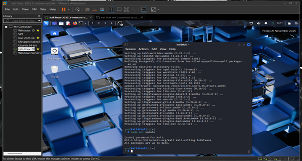
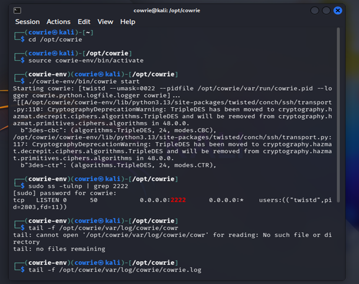
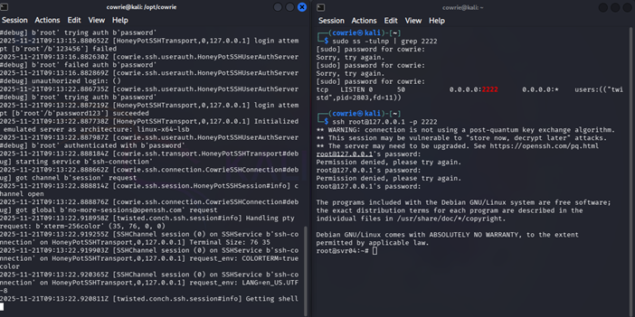
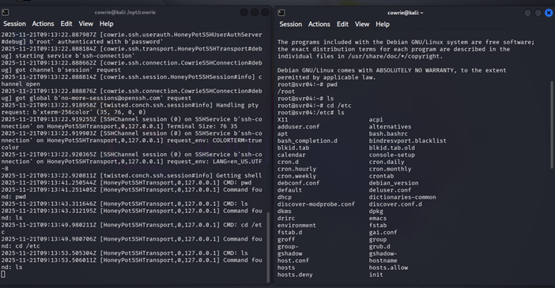
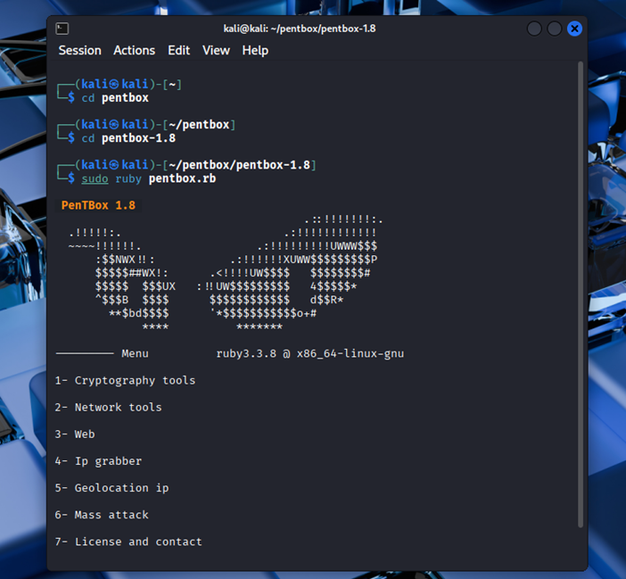
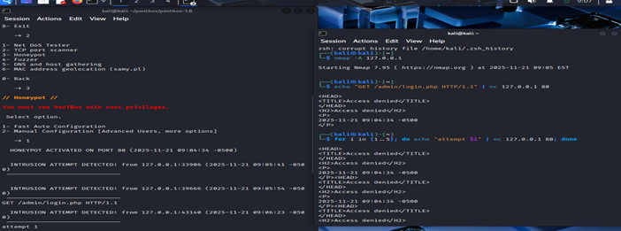
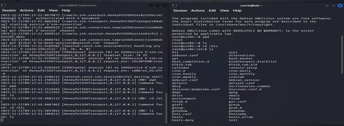

# Hybrid Honeypot Lab – Cowrie + Pentbox

## Project Overview

This project demonstrates the implementation of a **Hybrid Honeypot System** using:

-  Cowrie (Medium-Interaction SSH/Telnet Honeypot)
-  Pentbox (Low-Interaction Port Honeypot)

The lab was deployed inside a virtualized environment using VMware and Kali Linux to safely simulate and analyze cyber attack behavior.

This project focuses on capturing attacker activities such as:

- SSH brute-force attempts
- Port scanning (Reconnaissance)
- Command execution
- Unauthorized access attempts
- Login credential guessing

---

## Objectives

- Deploy Cowrie and Pentbox honeypots
- Simulate cyber attacks in a controlled environment
- Capture attacker behavior safely
- Analyze logs and extract insights
- Understand real-world attack patterns
- Strengthen defensive strategies using collected intelligence

---

## System Architecture

```text
                ┌───────────────────────────────┐
                │   Attacker Machine            │
                │ (Kali Linux / External Host)  │
                └───────────────┬───────────────┘
                                │
                                ▼
                        ┌───────────────┐
                        │   Network     │
                        └───────────────┘
                                │
                                ▼
        ┌────────────────────────────────────────────┐
        │        Kali Linux Honeypot VM              │
        │--------------------------------------------│
        │  🐧 Cowrie  (SSH/Telnet - Port 2222)      │
        │  📡 Pentbox (Fake Services - Port 80)     │
        └────────────────────────────────────────────┘
                                │
                                ▼
                ┌───────────────────────────────┐
                │  Log Collection (JSON / TXT)  │
                └───────────────┬───────────────┘
                                │
                                ▼
                ┌───────────────────────────────┐
                │  Log Analysis & Reporting     │
                └───────────────────────────────┘
```

### Explanation

- Attacker performs scanning & brute-force
- Honeypots capture activity
- Logs stored in JSON & TXT
- Logs analyzed for attack patterns

---

## Tools & Technologies Used

| Category | Tool | Purpose |
|-----------|------|---------|
| Virtualization | VMware Workstation | Create isolated lab environment |
| Operating System | Kali Linux | Host honeypot services |
| Honeypot (Medium Interaction) | Cowrie | Capture SSH/Telnet login attempts & commands |
| Honeypot (Low Interaction) | Pentbox | Detect port scans & fake service interactions |
| Attack Simulation | Nmap | Port scanning & reconnaissance testing |
| Attack Simulation | Hydra | SSH brute-force testing |
| Programming | Python 3 | Runtime for Cowrie |
| Version Control | Git | Repository management |

---

### Ports Used

| Service | Port | Purpose |
|----------|------|----------|
| SSH Honeypot | 2222 | Capture brute-force login attempts |
| Fake HTTP Service | 80 | Trigger port scan detection |

---

## Implemented Features

- SSH login attempt logging
- Fake Linux shell interaction recording
- Command execution tracking
- Port scan detection
- JSON structured logging
- Attack simulation using Nmap & SSH
- Log analysis & reporting

---

## Technology Stack


---

## Attacks Captured

- SSH brute-force attacks
- Password guessing attempts
- Port scanning (Full port scan)
- Command execution inside honeypot shell
- Directory navigation attempts
- Fake file download attempts

---

## Log Analysis

Captured Data Includes:

- Attacker IP address
- Timestamp of attack
- Username attempts
- Password attempts
- Commands executed
- Session duration
- Frequency of intrusion attempts

---

## Security Mechanisms Applied

- VM Isolation (Safe Lab Environment)
- Non-root execution of Cowrie
- Network segmentation
- Log file protection
- Controlled attack simulation
- No real system exposure

---

## Future Enhancements

- ELK Stack Integration (SIEM)
- Cloud Deployment (AWS / Azure)
- Machine Learning-based Log Analysis
- Distributed Honeynet Deployment
- Real-time alerting system

---

## Repository Structure

```
Hybrid-Honeypot-Lab-Cowrie-Pentbox/
│
├── README.md
├── setup/
├── attack-simulation/
├── logs-analysis/
├── report/
└── presentation/
```

---
## Project Screenshots

### Environment Setup


---

### Cowrie Deployment


---

### Cowrie Deployment (Step 2)


---

### Cowrie Attack Simulation


---

### Pentbox Deployment


---

### Pentbox Attack Detection


---

### Attack Logs




---

## Disclaimer

This project was developed strictly for educational and ethical cybersecurity research purposes. All attack simulations were conducted in an isolated lab environment.

---

## Author

**Bandari Vathan Sai**  
B.Tech CSE (Cybersecurity)  
Aspiring Penetration Tester
